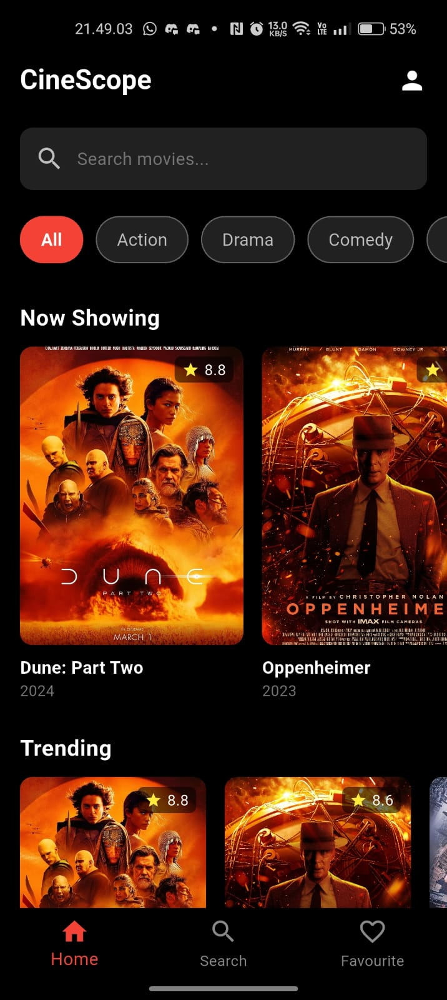
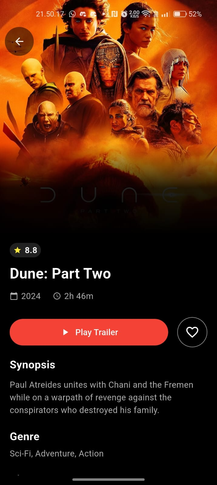

# CineScope - Aplikasi Katalog Film (UAS Pemrograman Mobile)

## 🚀 Status Proyek: Integrasi RESTful API & Persistence

Aplikasi ini adalah pengembangan lanjutan dari proyek UTS dengan fokus utama pada **Integrasi Data Real-Time** menggunakan RESTful API publik dan **Manajemen State/Arsitektur** yang terstruktur.

Aplikasi ini telah menggantikan semua sumber data dummy statis dengan data yang diambil secara real-time dari **TheMovieDB (TMDb) API** melalui protokol HTTP GET.

## 🎯 Tujuan Aplikasi

1.  **Integrasi API (HTTP Request):** Mengganti semua sumber data statis dengan data dari TheMovieDB (TMDb) melalui protokol HTTP GET.
2.  **Model & Parsing:** Melakukan JSON Serialization (parsing) data dari API ke dalam Dart Object (`Movie` Model).
3.  **Manajemen State & Asynchronous UI:** Menerapkan penanganan status `Loading`, `Success`, dan `Error` pada UI menggunakan pola arsitektur **Provider (ViewModel)**.
4.  **Fitur Pencarian & Filter:** Mengimplementasikan pencarian film berdasarkan judul dan filter berdasarkan genre, langsung dari API.
5.  **Arsitektur Kode:** Memisahkan logika aplikasi menjadi lapisan `Service`, `ViewModel`, dan `View`.
6.  **Persistensi:** Menggunakan Firebase Authentication & Firestore untuk menyimpan status login dan daftar film favorit pengguna.

## 🛠️ Spesifikasi Teknis: API TheMovieDB (TMDb)

Semua data film (Now Playing, Popular, Top Rated, Detail, Search, dan Genre) diambil dari [The Movie Database (TMDb) API](https://www.themoviedb.org/).

| Tipe Data | Endpoint yang Digunakan (dari `lib/constants.dart` dan `lib/services/movie_service.dart`) | Keterangan |
| :--- | :--- | :--- |
| **Base URL** | `https://api.themoviedb.org/3` | URL dasar untuk semua permintaan. |
| **Image URL** | `https://image.tmdb.org/t/p/w500` | URL dasar untuk poster film. |
| **Film Now Playing** | `/movie/now_playing` | Ditampilkan di bagian "Now Showing" pada Home Screen. |
| **Film Trending** | `/movie/popular` | Diambil sebagai sumber data "Trending" di Home Screen. |
| **Film Top Rated** | `/movie/top_rated` | Ditampilkan di bagian "Top Rated" di Home Screen. |
| **Pencarian Film** | `/search/movie` | Digunakan untuk fungsionalitas pencarian di Search Screen. |
| **Daftar Genre** | `/genre/movie/list` | Untuk mengisi filter genre. |
| **Detail Film** | `/movie/{movie_id}` | Mengambil detail sinopsis, durasi, dll. |
| **Aktor/Sutradara** | `/movie/{movie_id}/credits` | Mengambil data sutradara dan daftar pemeran. |
| **Trailer** | `/movie/{movie_id}/videos` | Mengambil kunci YouTube untuk fitur "Play Trailer". |

## 📐 Arsitektur & Teknologi

* **State Management:** `provider`
* **Service Layer:** Menggunakan `package:http` untuk berinteraksi dengan TMDb API (diimplementasikan di `MovieService`).
* **Backend Asli:** Firebase (Authentication, Firestore) untuk fungsionalitas Login/Register dan data Favorit.
* **Integrasi Lain:** `url_launcher` untuk membuka tautan trailer di YouTube.

---

## 📱 Halaman dan Fungsi

1.  **Halaman Login (`/login`) & Register (`/register`)**
    - Menggunakan **Firebase Auth** untuk otentikasi.
    - Status login disimpan di `shared_preferences`.
    - 
2.  **Halaman Beranda (`/` atau `/home`)**
    - Menampilkan film dari kategori "Now Showing", "Trending", dan "Top Rated" yang diambil secara **Real-Time dari TMDb API**.
    - Menampilkan **Filter Genre** yang datanya diambil dari API.
    - Menerapkan **Indikator Loading (`CircularProgressIndicator`)** saat data sedang diambil dan **Pesan Empty State** jika tidak ada film (saat difilter).
    - 
3.  **Halaman Pencarian (`/search`)**
    - Melakukan pencarian film (`/search/movie` API) secara **Real-Time**.
    - Menerapkan **Filter Genre** dan menampilkan **State Loading/Empty**.
    - Menampilkan hasil pencarian menggunakan _widget_ kartu film yang dinamis.
    - _Catatan: Gambar demo lama mungkin menampilkan "Popular Searches" yang kini telah diganti dengan tampilan GridView hasil pencarian/filter dinamis._
    - 
4.  **Halaman Detail Film (`/movie-detail`)**
    - Mengambil data detail film, sutradara, pemeran, dan kunci trailer secara **Real-Time** dari TMDb API.
    - Menyediakan fitur **Add to Favourite** yang menyimpan ID film ke **Cloud Firestore**.
    - Menampilkan tombol **Play Trailer** yang membuka video YouTube (jika trailer tersedia).
    - 
5.  **Halaman Favorit (`/favourite`)**
    - Memuat daftar ID film favorit dari **Cloud Firestore** dan kemudian mengambil detail film masing-masing dari TMDb API.
    - Menampilkan **State Loading** dan **State Empty** jika belum ada favorit.
    - 

---

## 🧭 Cara Penggunaan Aplikasi

Berikut adalah panduan langkah demi langkah untuk menggunakan aplikasi CineScope:

1.  **Login atau Registrasi:**

    - Saat pertama kali membuka aplikasi, Anda akan diarahkan ke **Halaman Login**.
    - **Login:** Masukkan email dan kata sandi yang telah didaftarkan melalui Firebase, lalu tekan **"Sign In"**.
    - **Registrasi:** Tekan **"Sign Up"** untuk diarahkan ke **Halaman Registrasi**. Isi Nama, Email, dan Kata Sandi, lalu tekan **"Create Account"**. Akun Anda akan dibuat di Firebase dan Anda akan otomatis masuk.

2.  **Menjelajahi Film (Halaman Beranda):**

    - Setelah login, Anda akan masuk ke **Halaman Beranda**.
    - Di sini Anda dapat melihat kategori film: "Now Showing", "Trending", dan "Top Rated". Data ini diambil secara **Real-Time dari TMDb API**.
    - Anda bisa _scroll_ ke kanan pada setiap kategori untuk melihat film teratas (5 film) atau tekan **"See All"** untuk melihat daftar lengkap di halaman kategori.
    - **Filter Genre:** Gunakan chip genre di bagian atas ("All", "Action", "Drama", dll.) yang datanya diambil dari API, untuk memfilter film di semua kategori.
    - **Pull to Refresh:** Tarik ke bawah halaman (Pull-to-Refresh) untuk memuat ulang data film terbaru dari API.

3.  **Mencari Film:**

    - Tekan **ikon Search** (kaca pembesar) di _bottom navigation bar_ atau ketuk _search bar_ di Halaman Beranda untuk masuk ke **Halaman Pencarian**.
    - **Pencarian Real-Time:** Ketik judul film di _search bar_. Hasil pencarian akan diambil dari TMDb API secara dinamis saat Anda mengetik.
    - **Filter di Pencarian:** Gunakan chip genre di bawah _search bar_ untuk mempersempit hasil pencarian.
    - **Loading & Empty State:** Saat mencari atau memfilter, Anda akan melihat indikator *loading* (Circular Progress Indicator) atau pesan *Empty State* jika tidak ada hasil.

4.  **Melihat Detail Film:**

    - Ketuk **gambar/kartu film** mana saja di Halaman Beranda atau Halaman Pencarian.
    - Anda akan diarahkan ke **Halaman Detail Film** yang menampilkan informasi lengkap, termasuk poster, rating, tahun, durasi, sinopsis, sutradara, pemeran, yang semuanya diambil dari TMDb API.
    - **Play Trailer:** Tekan tombol **"Play Trailer"**. Jika trailer tersedia (dicek dari TMDb API), tautan YouTube akan terbuka menggunakan `url_launcher`. Jika tidak, tombol akan dinonaktifkan.

5.  **Menambah/Menghapus Favorit:**

    - Di **Halaman Detail Film**, tekan **ikon Hati** (❤️) di sebelah tombol *Play Trailer*.
    - Aksi ini akan menyimpan atau menghapus ID film dari koleksi **Firestore** pengguna yang sedang login.

6.  **Melihat Daftar Favorit:**

    - Tekan **ikon Favourite** (hati) di _bottom navigation bar_.
    - **Akses Firestore:** Halaman ini memuat ID favorit dari Firestore dan kemudian mengambil detail film lengkap (poster, rating, dll.) dari TMDb API.

7.  **Logout:**
    - Di **Halaman Beranda**, tekan **ikon Profil** (orang) di pojok kanan atas _app bar_.
    - Sebuah menu _dropdown_ akan muncul menampilkan nama dan email Anda yang terdaftar.
    - Tekan **"Logout"** untuk keluar dari aplikasi. Ini akan menghapus status autentikasi Firebase dan data lokal, serta mereset daftar favorit.

---
