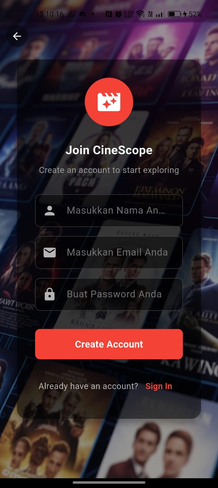

# CineScope - Aplikasi Katalog Film (UTS Pemrograman Mobile)

## 🎬 Tema dan Tujuan

**CineScope** adalah aplikasi mobile yang dikembangkan sebagai tugas Ujian Tengah Semester (UTS) mata kuliah Pemrograman Mobile (Semester Ganjil 2025/2026).

- **Tema:** Katalog Film 🎬
- **Tujuan:** Merancang dan mengimplementasikan antarmuka aplikasi mobile menggunakan _framework_ Flutter, menerapkan konsep _layout_, _widget_, dan navigasi antar halaman. Versi ini menggunakan **data _dummy_** (disimpan secara lokal dalam format JSON) dan mengimplementasikan arsitektur **MVVM (Model-View-ViewModel)** untuk pemisahan kode yang bersih. Struktur data dirancang untuk memungkinkan integrasi dengan API publik (seperti TMDb) di masa mendatang.

---

## 📱 Halaman dan Fungsi

Aplikasi ini terdiri dari halaman/rute berikut:

1.  **Halaman Login (`/login`)**
    - Menampilkan kolom untuk email dan kata sandi.
    - Mensimulasikan login pengguna dan menyimpan status login secara lokal (`shared_preferences`).
    - Menavigasi ke Halaman Register atau Halaman Beranda.
    - 
2.  **Halaman Register (`/register`)**
    - Menampilkan kolom untuk nama lengkap, email, dan kata sandi.
    - Mensimulasikan registrasi pengguna dan menyimpan status login secara lokal.
    - Menavigasi ke Halaman Login atau Halaman Beranda.
    - 
3.  **Halaman Beranda (`/` atau `/home`)**
    - Menampilkan dasbor utama setelah login.
    - Menampilkan daftar film yang dikategorikan ("Now Showing", "Trending", "Top Rated") yang diambil dari data _dummy_.
    - Menyertakan fungsionalitas filter genre.
    - Berisi _search bar_ (palsu) yang menavigasi ke Halaman Pencarian.
    - Menampilkan _bottom navigation bar_ untuk Beranda, Pencarian, dan Favorit.
    - Menyertakan ikon profil dengan menu _dropdown_ yang menampilkan info pengguna (dummy) dan opsi Logout.
    - 
4.  **Halaman Pencarian (`/search`)**
    - Menyediakan _search bar_ aktif (fokus otomatis dengan keyboard).
    - Memungkinkan pengguna mencari film berdasarkan judul.
    - Menyertakan filter genre untuk mempersempit hasil pencarian.
    - Menampilkan "Popular Searches" pada awalnya.
    - Menampilkan hasil pencarian/filter menggunakan _widget_ kartu film yang dapat digunakan kembali.
    - Menampilkan _bottom navigation bar_.
    - 
5.  **Halaman Detail Film (`/movie-detail`)**
    - Diakses dengan mengetuk kartu film dari hasil Beranda atau Pencarian.
    - Menampilkan informasi detail tentang film tertentu (poster, judul, rating, tahun, durasi, sinopsis, genre, sutradara, pemeran) yang diambil berdasarkan ID.
    - Menampilkan efek _header_ yang bisa _collapse_ (`SliverAppBar`).
    - Menampilkan tombol "Play Trailer" (hanya UI) dan "Add to Favourite".
    - Menampilkan daftar "Similar Movies".
    - 
6.  **Halaman Favorit (`/favourite`)**
    - Menampilkan film yang telah ditandai sebagai favorit oleh pengguna.
    - Memuat ID film favorit dari penyimpanan lokal (`shared_preferences`) dan mengambil detailnya.
    - Menampilkan ikon dan pesan jika belum ada favorit yang ditambahkan.
    - Menampilkan _bottom navigation bar_.
    - 

---

## 🧭 Cara Penggunaan Aplikasi

Berikut adalah langkah-langkah umum untuk menggunakan aplikasi CineScope:

1.  **Login atau Registrasi:**

    - Saat pertama kali membuka aplikasi, Anda akan diarahkan ke **Halaman Login**.
    - Jika sudah memiliki akun, masukkan email dan kata sandi Anda, lalu tekan **"Sign In"**.
    - Jika belum memiliki akun, tekan **"Sign Up"** untuk diarahkan ke **Halaman Registrasi**. Isi data yang diperlukan (nama, email, kata sandi) dan tekan **"Create Account"**. Anda akan otomatis masuk ke aplikasi setelah registrasi.

2.  **Menjelajahi Film (Halaman Beranda):**

    - Setelah login, Anda akan masuk ke **Halaman Beranda**.
    - Di sini Anda dapat melihat daftar film yang dikategorikan seperti "Now Showing", "Trending", dan "Top Rated".
    - Anda bisa _scroll_ ke kanan pada setiap kategori untuk melihat lebih banyak film.
    - Gunakan **Filter Genre** di bagian atas untuk menampilkan film hanya dari genre yang dipilih (misalnya, "Action", "Drama"). Film di semua kategori akan diperbarui sesuai genre yang dipilih.

3.  **Mencari Film:**

    - Tekan **ikon Search** (kaca pembesar) di _bottom navigation bar_ atau ketuk _search bar_ di Halaman Beranda untuk masuk ke **Halaman Pencarian**.
    - Ketik judul film yang ingin Anda cari di _search bar_ bagian atas. Hasil pencarian akan muncul secara otomatis saat Anda mengetik.
    - Anda juga bisa menggunakan **Filter Genre** di Halaman Pencarian untuk mempersempit hasil pencarian.
    - Pada awalnya, halaman ini menampilkan "Popular Searches" yang bisa Anda ketuk (fungsionalitas _tap_ belum diimplementasikan di versi ini).

4.  **Melihat Detail Film:**

    - Ketuk **gambar/kartu film** mana saja di Halaman Beranda atau Halaman Pencarian.
    - Anda akan diarahkan ke **Halaman Detail Film** yang menampilkan informasi lengkap seperti poster, judul, rating, tahun, durasi, sinopsis, genre, sutradara, dan pemeran.
    - Di halaman ini, Anda juga bisa melihat daftar "Similar Movies".

5.  **Menambah/Menghapus Favorit:**

    - Di **Halaman Detail Film**, tekan **ikon Hati** (❤️).
    - Jika film belum favorit, ikon akan berubah menjadi hati penuh (❤️) dan film ditambahkan ke daftar favorit Anda.
    - Jika film sudah favorit, menekan ikon hati penuh akan mengubahnya kembali menjadi garis tepi (♡) dan menghapusnya dari daftar favorit.

6.  **Melihat Daftar Favorit:**

    - Tekan **ikon Favourite** (hati) di _bottom navigation bar_.
    - Anda akan diarahkan ke **Halaman Favorit** yang menampilkan semua film yang telah Anda tambahkan.
    - Jika belum ada film favorit, akan muncul ikon dan pesan.

7.  **Logout:**
    - Di **Halaman Beranda**, tekan **ikon Profil** (orang) di pojok kanan atas _app bar_.
    - Sebuah menu _dropdown_ akan muncul menampilkan nama dan email Anda (dummy).
    - Tekan **"Logout"** untuk keluar dari aplikasi dan kembali ke Halaman Login. Status login Anda akan dihapus.

---
